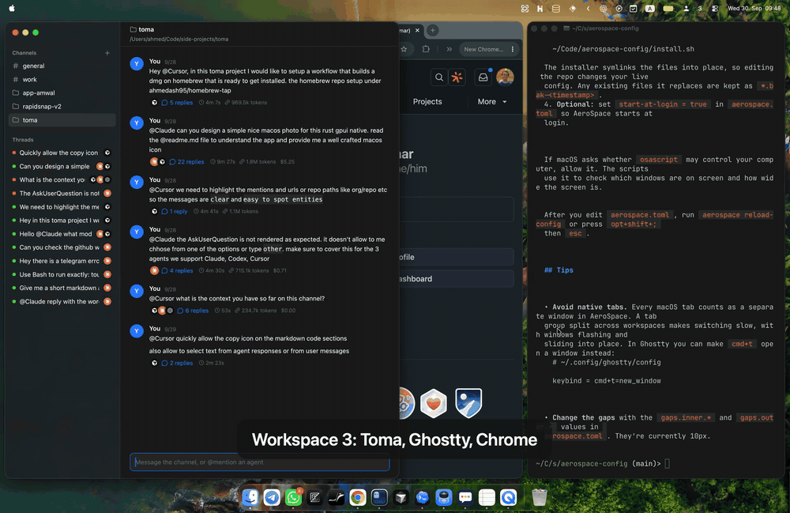

# aerospace-config

My [AeroSpace](https://github.com/nikitabobko/AeroSpace) setup, tuned to feel like Amethyst: preset layouts you can cycle through, 10px gaps, no empty tiles for windows you can't see, and a layout that remembers itself: windows stay on their workspaces when AeroSpace restarts, new windows join their app's usual workspace, and each monitor setup (office, home desk, laptop only) keeps its own arrangement.

[](demo.mp4)

*Click for the full-quality video.*

## Layouts

| Layout | What it looks like |
|---|---|
| **Fullscreen** | Every window fills the screen; switch between them with `alt-h` / `alt-l` |
| **Column** | All windows side by side at equal widths |
| **Rows** | All windows stacked top to bottom at equal heights |
| **Custom (60/40)** | Focused window takes the left 60%, the rest stack on the right 40%. A window that's alone on the workspace keeps the 60% size and the right side stays empty |

The layout you pick is remembered for that workspace, separately for each monitor setup. It's re-applied when a new window opens there, after AeroSpace restarts and when you plug monitors in or out. A setup where you never picked a layout for a workspace uses the last one you picked anywhere.

Arranging a workspace by hand (`opt+/`, `opt+,`, and `r` or `opt+shift+h/j/k/l` in service mode) stops the remembered layout from being re-applied there, until you pick a layout again.

## Shortcuts

`opt` = Option/Alt.

| Keys | Action |
|---|---|
| `opt+ctrl+←` | Cycle to the next layout (Fullscreen → Column → Rows → Custom) |
| `opt+ctrl+f` | Fullscreen |
| `opt+ctrl+c` | Column |
| `opt+ctrl+r` | Rows |
| `opt+ctrl+m` | Custom 60/40 (the focused window becomes the big one) |
| `cmd+opt+ctrl+←` | Move the focused window to the next position (wraps around) |
| `opt+1…9`, `opt+a…z` | Switch to that workspace |
| `opt+shift+1…9`, `opt+shift+a…z` | Send the focused window to that workspace |
| `opt+h/j/k/l` | Focus left / down / up / right |
| `opt+shift+h/j/k/l` | Move the window left / down / up / right |
| `opt+shift+;` | Service mode (`esc` there reloads the config) |

The letters H, J, K and L aren't workspaces, because those keys are used for focus and movement. Everything not listed above uses AeroSpace's defaults.

## Files

This repo is meant to be cloned as `~/.config/aerospace`, the folder where AeroSpace looks for its config. Nothing needs to be linked or copied.

```
aerospace.toml                 AeroSpace config
install.sh                     installer / updater (see below)
scripts/cycle-layout.sh        layout switching, remembered per workspace and monitor setup
scripts/hide-ghost-windows.sh  keeps invisible windows from taking tiles
scripts/workspace-memory.sh    puts windows, workspaces and layouts back after restarts and monitor changes
scripts/state.sh               shared helpers: where state lives, which monitor setup is connected
```

- **`cycle-layout.sh`** switches between the layouts. It remembers each workspace's layout per monitor setup, so cycling picks up where you left off and the layout comes back after restarts and monitor changes. For Custom it also remembers which window is the big one. The `layouts=(...)` line at the top sets which layouts are in the cycle and in what order. `main_ratio` sets the Custom split, and the script takes gap sizes from `aerospace.toml` into account.
- **`hide-ghost-windows.sh`** runs on every focus and workspace change. AeroSpace still gives a tile to windows macOS isn't drawing: inactive native tabs, minimized windows and windows on another macOS Space. That leaves empty space in the layout. The script floats those windows so they stop taking space, and tiles them again once they're visible.
- **`workspace-memory.sh`** keeps track of where things belong and puts them back. Normally AeroSpace only tracks this while it's running, so a restart piles every window onto one workspace.
  - **Restarts and crashes.** The script saves which workspace each window is on whenever focus or the workspace changes, and every 3 seconds as a backup, because moving a window that isn't focused doesn't trigger any callback. On startup it moves each window back, matching by window ID, then by app and window title, then by the app's last workspace. The last match also places apps after a reboot or relaunch, when window IDs change. Then it puts workspaces back on their monitors and re-applies their layouts.
  - **Monitor setups.** The set of connected monitors (by name) identifies a setup, such as office, home desk or laptop only. For each setup the script remembers which monitor every workspace is on and which ones are showing. When monitors are plugged in or out, it puts that setup's arrangement back within about 2 seconds. A setup it hasn't seen before keeps AeroSpace's arrangement and is remembered from then on. Two monitors of the same model are told apart by their left-to-right order.
  - **New windows.** A new window joins its app's other windows when they're all on one workspace, or goes where the app was last seen when it's the app's first window. It stays where it opened when the app already has a window on that workspace, when the app is spread over several workspaces, and for dialogs and other floating windows. If you're using the app, you follow the window to its workspace. List apps that should always open where you are in `roaming_apps` at the top of the script. Rules you add to `aerospace.toml` for specific apps take precedence.
  - **Limits.** Window order within a workspace isn't restored, because AeroSpace has no command to read or rebuild the layout tree. The new window briefly appears on the current workspace before it moves. Several windows of one app whose titles changed (browser windows, after a relaunch) all go to the app's last workspace.
  - State is kept in `~/.local/state/aerospace/`, with one folder per setup under `setups/`. `restore.log` there lists what each restore, setup change and new window moved.

## Setting up a new Mac

```sh
curl -fsSL https://raw.githubusercontent.com/ahmedash95/aerospace-config/main/install.sh | bash
```

The installer:
- Installs AeroSpace and [JankyBorders](https://github.com/FelixKratz/JankyBorders) (the border around the focused window) with Homebrew if they're missing. Set `NO_BREW=1` to skip this.
- Clones this repo to `~/.config/aerospace`, the folder where AeroSpace looks for its config. If the repo is already there, it pulls the latest version instead, so the same command also updates.
- Renames anything it would replace, such as an existing `~/.config/aerospace` or `~/.aerospace.toml`, to `*.bak-<timestamp>`. AeroSpace won't start when a config file exists in both places.
- Reloads AeroSpace's config if it's running, or starts it.

The first time AeroSpace starts, grant it Accessibility access (System Settings → Privacy & Security → Accessibility). To have it start at login, set `start-at-login = true` in `aerospace.toml`.

<details>
<summary>Manual install</summary>

```sh
brew install --cask nikitabobko/tap/aerospace
brew install FelixKratz/formulae/borders   # optional
mv ~/.aerospace.toml ~/.aerospace.toml.bak 2>/dev/null
git clone https://github.com/ahmedash95/aerospace-config.git ~/.config/aerospace
open -a AeroSpace
```

</details>

If macOS asks whether `osascript` may control your computer, allow it. The scripts use it to check which windows are on screen and how wide the screen is.

Editing the repo changes your live config. After you edit `aerospace.toml`, run `aerospace reload-config` or press `opt+shift+;` then `esc`.

## Tips

- **Avoid native tabs.** Every macOS tab counts as a separate window in AeroSpace. A tab group split across workspaces makes switching slow, with windows flashing and sliding into place. In Ghostty you can make `cmd+t` open a window instead:
  ```
  # ~/.config/ghostty/config
  keybind = cmd+t=new_window
  ```
- **Change the gaps** with the `gaps.inner.*` and `gaps.outer.*` values in `aerospace.toml`. They're currently 10px.
